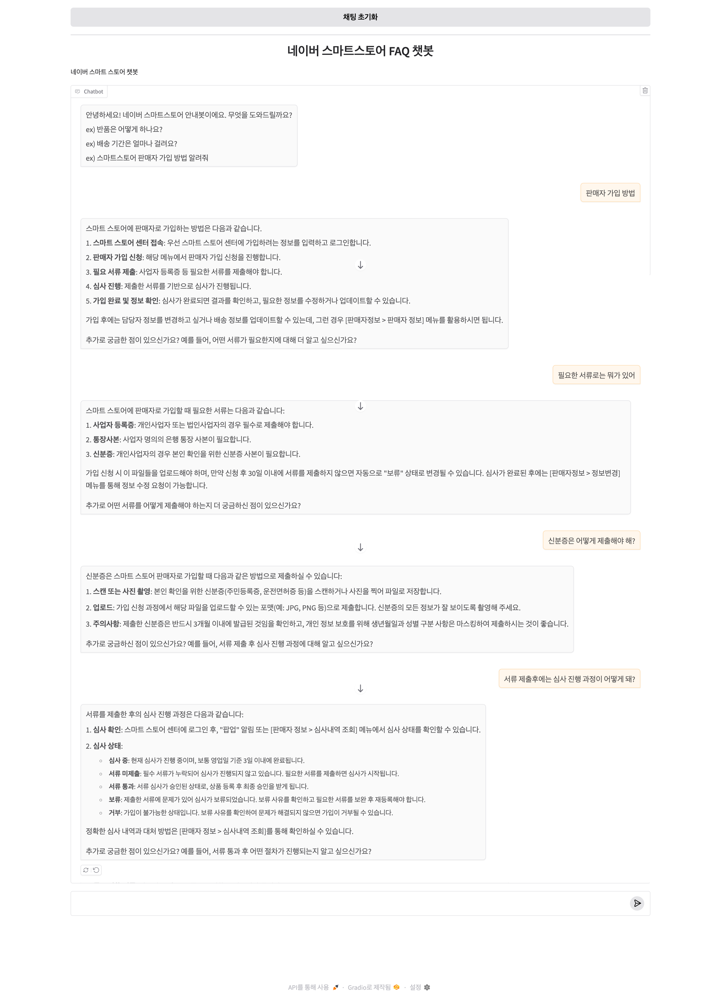

# 네이버 QA 챗봇 프로젝트

```
이 프로젝트는 네이버 스마트스토어 QA 데이터를 벡터 데이터베이스(Vector DB)에 저장하고, 질문이 들어오면 유사한 내용을 검색하여 친절하게 답변해주는 챗봇입니다.
```



---

## 프로젝트 구조
```bash
.
├── src/
│   ├── server.py      # FastAPI 서버
│   ├── chatbot.py     # Gradio UI 실행 파일
│   ├── init_db.py     # 벡터 DB 초기화 스크립트
│   └── chat_redis.py  # 레디스 관련 함수 모듈
├── .env.template.     # 환경변수 예시
├── .gitignore
├── qa_vector.db       # init_db로 만든 밀버스DB
├── README.md          # 지금 읽고 있는 이것
├── requirements.txt
└── run.sh             # 실행 스크립트
````

---

## 기술 스택
- **언어 및 프레임워크**
  - Python 3.10+
  - FastAPI (API 서버)
  - Gradio (챗봇 UI)
- **데이터베이스**
  - Redis (채팅 내역 관리)
  - Milvus Lite (QA 임베딩 저장)
- **ML & NLP**
  - OpenAI Embeddings (문장 임베딩)
  - OpenAI 4o mini (LLM 모델)
- **인프라**
  - Shell Script (`run.sh` 실행 자동화)

---

## 실행 전 준비
1. **Redis 설치 필수**  
   - macOS: `brew install redis`  
   - Ubuntu: `sudo apt-get install redis-server`  
   - Windows: [MSI 설치 파일](https://github.com/microsoftarchive/redis/releases) 다운로드  

2. **권한 설정**  
```bash
chmod +x run.sh
```

3. **환경 변수 설정**   
* .env.template 을 .env로 이름 수정
* OPENAI_API_KEY 설정

---

## 실행 방법

아래 명령어 하나로 **가상환경 생성 → 패키지 설치 → Redis 실행 → FastAPI 서버 실행 → Gradio UI 실행**이 자동으로 진행됩니다.

```bash
./run.sh
```

* FastAPI 서버: [http://127.0.0.1:8000](http://127.0.0.1:8000)
* Gradio UI: 실행 후 터미널에 표시되는 URL 접속 [127.0.0.1:7860](127.0.0.1:7860)

---

## 참고

* `init_db.py`는 원래 2717개의 질문을 벡터화하여 `qa_vector.db`를 생성하는 용도입니다.
  하지만 이미 `qa_vector.db` 파일을 제공하므로, 따로 실행하지 않아도 됩니다.
* 필요하다면 직접 DB를 다시 만들 수 있습니다:

  ```bash
  python src/init_db.py
  ```